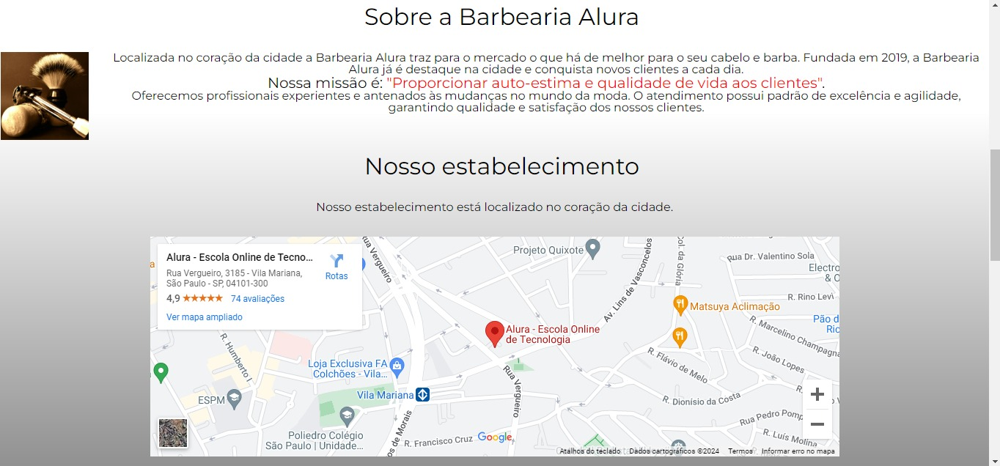

# Barbearia Alura

Este é o repositório do site da Barbearia Alura. Aqui você encontrará o código-fonte e os arquivos necessários para o site.

## Funcionalidades Principais

- **Home:** Página inicial onde apresento a Barbearia Alura e seus serviços, com um pseudo vídeo do YouTube e uma pseudo localização incorporados.
- **Produtos:** Menu de preços detalhado dos serviços oferecidos pela barbearia.
- **Contato:** Informações de contato para agendamentos e dúvidas, incluindo um formulário e uma tabela com os horários disponíveis.

## Tecnologias Utilizadas

- HTML
- CSS

## Autor

Desenvolvido por [Mateus Barbalho Soares](https://github.com/mateusbarbalho1).

Este projeto foi criado como parte do curso de HTML e CSS da Alura.

 |  | 
---|---|---
Home | Produtos | Contato

